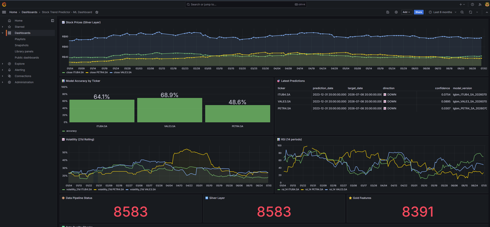
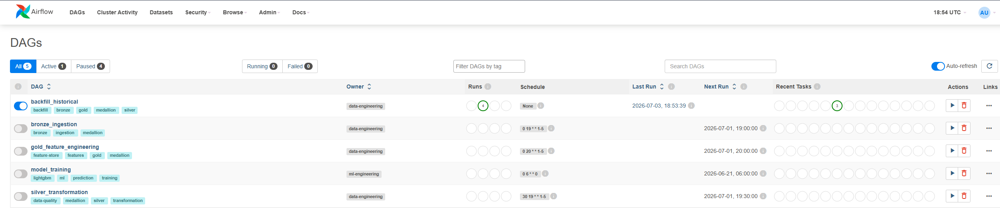
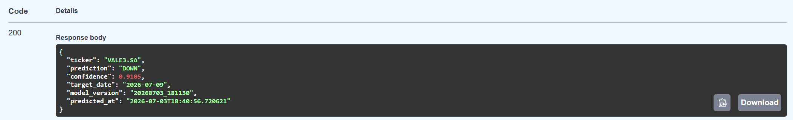

# 📈 Stock Trend Predictor - End-to-End ML Pipeline

Production-grade Machine Learning pipeline for stock market trend prediction using time series analysis.
Built with **Apache Airflow**, **Medallion Architecture** (Bronze → Silver → Gold), **LightGBM** with walk-forward validation, and **FastAPI** model serving.



---

## 🏗️ Architecture

```
┌─────────────────────────────────────────────────────────────────────────────┐
│                           Apache Airflow (Orchestration)                     │
│                                                                             │
│  ┌────────────┐   ┌──────────────┐   ┌────────────┐   ┌────────────────┐  │
│  │   Bronze   │ → │    Silver    │ → │    Gold    │ → │  ML Training   │  │
│  │ Ingestion  │   │ Transform +  │   │  Feature   │   │  Walk-Forward  │  │
│  │ (yfinance) │   │ Data Quality │   │   Store    │   │  + Prediction  │  │
│  └────────────┘   └──────────────┘   └────────────┘   └────────────────┘  │
│    Daily 19:00       Daily 19:30       Daily 20:00      Weekly (Sunday)     │
└─────────────────────────────────────────────────────────────────────────────┘
         │                    │                │                  │
         ▼                    ▼                ▼                  ▼
┌─────────────────────────────────────────────────────────────────────────────┐
│                     PostgreSQL 16 (Data Warehouse)                           │
│                                                                             │
│  ┌──────────────┐  ┌─────────────────┐  ┌───────────────────────────────┐  │
│  │   BRONZE     │  │     SILVER      │  │            GOLD               │  │
│  │              │  │                 │  │                               │  │
│  │ raw_stock_   │  │ stock_prices    │  │ feature_store (30+ features)  │  │
│  │ prices       │  │ (cleaned)       │  │ predictions                   │  │
│  │ ingestion_   │  │ data_quality_   │  │ model_performance             │  │
│  │ log          │  │ checks          │  │                               │  │
│  └──────────────┘  └─────────────────┘  └───────────────────────────────┘  │
└─────────────────────────────────────────────────────────────────────────────┘
                                                             │
                              ┌───────────────────────────────┘
                              ▼
┌─────────────────────────────────────────────────────────────────────────────┐
│                        Model Serving (FastAPI)                               │
│                                                                             │
│  GET  /predict/{ticker}        → Latest prediction + confidence             │
│  GET  /health                  → Service health check                       │
│  GET  /model/metrics/{ticker}  → Walk-forward validation results            │
│  GET  /monitor/{ticker}        → Drift detection & model performance        │
└─────────────────────────────────────────────────────────────────────────────┘
```

---

## 🚀 Quick Start

### Airflow Orchestration



### Prerequisites

- Docker & Docker Compose
- Python 3.9+ (for local development)
- `make` (optional, for shortcut commands)

### Setup & Run

```bash
# 1. Clone the repo
git clone https://github.com/IsaacMartins12/stock-trend-predictor-ml.git
cd stock-trend-predictor-ml

# 2. Build and start all services
make build
make up

# 3. Access Airflow UI
# URL:   http://localhost:8080
# Login: admin / admin

# 4. Load historical data (first-time setup)
make backfill

# 5. Train the ML model
docker compose exec airflow-webserver airflow dags trigger model_training

# 6. Start the prediction API
make api
```

### Without `make`

```bash
docker compose build
docker compose up -d
docker compose exec airflow-webserver airflow dags trigger backfill_historical
docker compose exec airflow-webserver airflow dags trigger model_training
```

---

## 📂 Project Structure

```
stock-trend-predictor-ml/
├── dags/                              # Airflow DAG definitions
│   ├── dag_bronze_ingestion.py        # Extract raw data → Bronze
│   ├── dag_silver_transformation.py   # Clean & validate → Silver
│   ├── dag_gold_features.py           # Feature engineering → Gold
│   ├── dag_model_training.py          # Train + predict (walk-forward CV)
│   └── dag_backfill_historical.py     # Full historical load (manual)
├── src/
│   ├── data/
│   │   ├── storage.py                 # PostgreSQL access layer (psycopg3)
│   │   ├── ingestion.py              # yfinance data extraction
│   │   ├── preprocessing.py          # Data cleaning & imputation
│   │   ├── database.py               # SQLAlchemy engine
│   │   └── models.py                 # ORM models
│   ├── features/
│   │   └── engineering.py            # Technical indicators & features
│   ├── models/
│   │   └── train.py                  # LightGBM + Walk-Forward Validation
│   ├── monitoring/
│   │   └── drift.py                  # Model drift detection
│   ├── pipeline/
│   │   └── orchestrator.py           # Local pipeline orchestration
│   └── serving/
│       └── app.py                    # FastAPI prediction endpoint
├── infrastructure/
│   ├── init.sql                      # Base schema (assets table)
│   └── medallion_schema.sql          # Medallion architecture schemas
├── configs/
│   └── config.yaml                   # Pipeline & model configuration
├── models/                           # Saved model artifacts (.pkl)
├── docker-compose.yml                # Full infrastructure stack
├── Dockerfile                        # App image (Airflow + ML deps)
├── Makefile                          # CLI shortcut commands
└── requirements.txt                  # Python dependencies
```

---

## 🛠️ Tech Stack

| Component | Technology |
|-----------|-----------|
| **Orchestration** | Apache Airflow 2.9 |
| **Data Warehouse** | PostgreSQL 16 |
| **Data Architecture** | Medallion (Bronze / Silver / Gold) |
| **ML Model** | LightGBM (Gradient Boosting) |
| **Validation** | Walk-Forward (Time Series CV) |
| **Feature Store** | PostgreSQL Gold Layer (30+ features) |
| **Model Serving** | FastAPI |
| **Model Monitoring** | Custom drift detection (PSI + KS test) |
| **Data Source** | Yahoo Finance (yfinance) |
| **Containerization** | Docker & Docker Compose |
| **Visualization** | Streamlit + Plotly |
| **Language** | Python 3.11 |

---

## 🤖 ML Pipeline Details

### Walk-Forward Validation

Unlike random K-Fold (which causes data leakage in time series), this project uses **walk-forward validation**:

```
Split 1: Train [──────────────] Test [████]
Split 2: Train [──────────────────] Test [████]
Split 3: Train [──────────────────────] Test [████]
Split 4: Train [──────────────────────────] Test [████]
Split 5: Train [──────────────────────────────] Test [████]
                                                    ↑
                                            ~63 days each
```

Each split trains only on past data and tests on the immediate future — exactly how it would work in production.

### Model Results (Walk-Forward CV)

| Ticker | Accuracy | F1 Score | Precision | Recall | Stability (σ) |
|--------|----------|----------|-----------|--------|---------------|
| PETR4.SA | 48.6% | 0.59 | 0.45 | 0.93 | ±15.9% |
| VALE3.SA | **68.9%** | **0.71** | 0.74 | 0.75 | ±2.9% |
| ITUB4.SA | **64.1%** | **0.70** | 0.69 | 0.77 | ±8.1% |

> VALE3 and ITUB4 show strong predictability with stable performance across folds.
> PETR4 is harder to predict (politically-driven volatility), which is a valid finding.

### Features Computed (Gold Layer)

| Category | Features |
|----------|----------|
| **Moving Averages** | SMA(5, 10, 21, 63), EMA(12, 26) |
| **Momentum** | RSI(7, 14), MACD, Signal, Histogram |
| **Volatility** | Realized Vol (21d, 63d), ATR(14) |
| **Bollinger Bands** | Upper, Lower, Width, Position |
| **Volume** | SMA(21), Volume Ratio, OBV |
| **Returns** | 1d, 5d, 21d (simple) |
| **Lags** | Close price lagged 1, 5, 21 days |
| **Target** | 5-day forward direction (binary) |

---

## 🔒 Data Quality & Governance

Automated checks run on every Silver transformation:

| Check | Description |
|-------|-------------|
| **Completeness** | No null close prices |
| **Consistency** | OHLC integrity (High ≥ Low) |
| **Validity** | No negative prices, volume ≥ 0 |
| **Freshness** | Recent data exists (not stale) |

All checks are logged in `silver.data_quality_checks` with full audit trail.

---

## 📡 Model Monitoring

The monitoring module tracks:

- **Prediction accuracy** over time (rolling window)
- **Feature drift** using Population Stability Index (PSI)
- **Distribution shifts** via Kolmogorov-Smirnov test
- **Model staleness** alerts when retraining is needed

---

## 📡 API Serving

FastAPI endpoint for real-time predictions:



```bash
# Get prediction for a ticker
curl http://localhost:8000/predict/VALE3.SA

# Response:
{
  "ticker": "VALE3.SA",
  "prediction": "UP",
  "confidence": 0.74,
  "target_date": "2026-07-09",
  "model_version": "lgbm_v1_20260703"
}
```

---

## 📋 Available Commands

```bash
make help              # Show all commands
make build             # Build Docker images
make up                # Start all services
make down              # Stop all services
make backfill          # Full historical data load
make trigger-bronze    # Manual bronze ingestion
make trigger-silver    # Manual silver transformation
make trigger-gold      # Manual gold features
make db-shell          # Connect to PostgreSQL
make check-dags        # Validate DAG syntax
make dashboard         # Run Streamlit locally
make api               # Start FastAPI serving
```

---

## 🗺️ Roadmap

- [x] Medallion Architecture (Bronze / Silver / Gold)
- [x] Apache Airflow orchestration (5 DAGs)
- [x] Automated data quality checks
- [x] Technical indicator feature store (30+ features)
- [x] LightGBM with walk-forward validation
- [x] Prediction generation & persistence
- [x] Model monitoring & drift detection
- [x] FastAPI model serving
- [x] Grafana dashboard for monitoring
- [ ] CI/CD pipeline (GitHub Actions)
- [ ] Additional models (XGBoost, LSTM)
- [ ] Multi-asset portfolio optimization

---

## 👤 Author

**Isaac Martins** — ML Engineer

---

## 📜 License

This project is licensed under the [MIT License](LICENSE).
